# RSES: Introduction to Deep Learning Course

Twin Karmakharm, & Fariba Yousefi

---

<!-- .slide: data-background="assets/img/rse-logo.svg" -->
<!-- .slide: data-background-opacity="0.2" -->

### Research Software Engineering Sheffield

* Increasing research impact through software
* Support and consultancy in research software and systems development and maintenance
    * Grant support
* Software optimisation, GPU and HPC
* Training, outreach and education activities
* Led by Dr. Paul Richmond
* Visit us at [https://rse.shef.ac.uk](https://rse.shef.ac.uk)

---

### Course Materials

All course materials can be found at:

[https://rses-dl-course.github.io/](https://rses-dl-course.github.io/)

---

### Course Schedule

* **10:00-11:30** | 01: Introduction to Deep Leaning and Neural Networks
* **12:00-13:30** | 02: Refining your neural network model and Wrap up
  
---

# Introduction to Deep Learning

---

## Examples of deep learning

---

### Self-driving cars
 
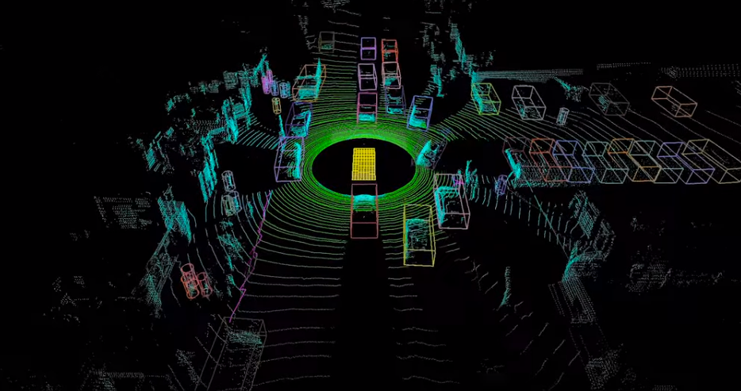

<span class="small-note">[https://blogs.nvidia.com/blog/2020/03/11/drive-labs-multi-view-lidarnet-self-driving-cars/](https://blogs.nvidia.com/blog/2020/03/11/drive-labs-multi-view-lidarnet-self-driving-cars/)</span>

Note:
- One of the most well developed applications of DL is in self driving cars

Lidar can give autonomous vehicles laser focus. By bouncing laser signals off the surrounding environment, these sensors can enable a self-driving car to construct a detailed and accurate 3D picture of what’s around it.
-  cars, trucks, buses, pedestrians, cyclists, and other road users.
---

### Playing GO


<span class="small-note">[https://www.bbc.co.uk/news/technology-35785875](https://www.bbc.co.uk/news/technology-35785875)</span>

Note:
The Chinese board game is considered to be a much more complex challenge for a computer than chess.

2016: **A computer program has beaten a master Go player 3-0 in a best-of-five competition, in what is seen as a landmark moment for artificial intelligence.**

---

### Impersonating celebrities

<iframe width="560" height="315" src="https://www.youtube.com/embed/cQ54GDm1eL0" frameborder="0" allow="accelerometer; autoplay; encrypted-media; gyroscope; picture-in-picture" allowfullscreen></iframe>

Note:
Deepfakes are synthetic media[2] in which a person in an existing image or video is replaced with someone else's likeness.

Obviously dangerous but there is also ongoing research into using deep learning to detect deep fakes.
---

### Mars mission

<span class="medium-note">Terrain classification, navigation, autonomous rover, etc.</span>

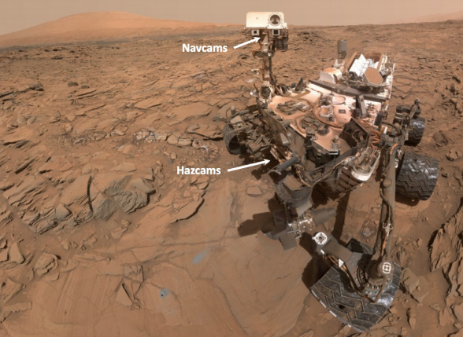

<span class="small-note">DeepTerramechanics: Terrain Classification and Slip Estimation for Ground Robots via Deep Learning, R. Gonzalez, K. Iagnemma</span>

Note:
Terramechanics plays a critical role in the areas of ground vehicles and ground mobile robots since understanding and estimating the variables influencing the vehicle-terrain interaction may mean the success or the failure of an entire mission. 

This research applies state-of-the-art algorithms in deep learning to two key problems: estimating wheel slip and classifying the terrain being traversed by a ground robot
---

### What else?

* Cancer detection
* Auto-recommendation (videos, shopping preferences, etc.)
* Digital assistants (Google Assistant, Siri, Echo)
* Language translation
* And many more...

---

### Definitions


Note:
- AI: Mimicking the intelligence or behaviour of humans or any other living entity
- Machine Learning: A technique by which a computer can learn from data without using a complex set of rules.
- Deep Learning: A technique to perform machine learning based on neural networks.

---

### Machine Learning (ML)

Statistical models that learns from data 

---

### A simple ML model

<object type="image/svg+xml" data="assets/img/ml-model.svg"></object>

e.g. predicting house price from no. of bedrooms <!-- .element: class="fragment" -->


<object type="image/svg+xml" data="assets/img/ml-model-houseprice.svg">
<param id="layer1" class="fragment" />
</object>


---

### Learning by examples
ML models learn by being shown many examples. Each example is a pair of Feature (input) and Label (desired output).

<table>
<tr><th>Feature (No. of bedrooms)</th><th>Label (Sale Price)</th></tr>
<tr><td>3</td><td>185,000</td></tr>
<tr><td>1</td><td>70,000</td></tr>
<tr><td>4</td><td>250,000</td></tr>
</table>
<br/>
<object type="image/svg+xml" data="assets/img/feature-label.svg">
<param id="layer1" class="fragment" data-fragment-index="1" />
<param id="layer2" class="fragment" data-fragment-index="2" />
</object>


---

### Feature engineering
Real-world applications often does not map neatly to a single feature

e.g. here's what happens when we plot using real data:<br/>
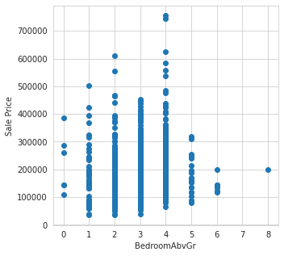

---

### Feature engineering
It's possible to use multiple features in our model...

What other features should we collect?

Note:
Feature engineering is the process of using domain knowledge to extract features from raw data. 
---


### Feature engineering
Examples of features with higher correlation:


<div style="display:flex; width: 100%">
    <div style="flex-grow: 1">
    Overall quality of the finish <br/>
    </div>
    <div style="flex-grow: 1">
    Ground floor living area <br/> 
    </div>
</div>

---

### Feature engineering
* We want to choose features most relevant to our model e.g. ones with high correlation

* It's possible to combine and transform multiple features to increase correlation and help our ML algorithms e.g. 

    ```html
    Total area = Garden area + Ground floor area + Second floor area + ...
    ```

* Often requires domain knowledge and intuition about the dataset

---

### Feature engineering

What if we want to create a model that detect cats?


Each feature is a scalar value

---

### Feature engineering

Cat detector:

<div style="display:flex; width: 100%">
    <div style="flex-grow: 1">
        
    </div>
    <div style="flex-grow: 1">
    Possible features (Low -> High level)
        <ul>
            <li>Colours</li>
            <li>Edges</li>
            <li>Shapes</li>
            <li>Texture</li>
            <li>Anatomy (ears, eyes, mouth, face, limbs, etc.</li>
        </ul>
    </div>
</div>

---

### Feature engineering

Cat detector:


---

### ML Methodologies
We can use various algorithms as the 'model', DL is one of them...

* Clustering (e.g. K-means)
* Bayes
* Decision trees
* Regression
* State vector machines (SVM)
* Deep Learning (Neural Networks)
* etc.

---

### Deep Learning

Uses 'deep' neural networks, i.e. neural network with many layers.


---

### Why use Deep Networks
Standard ML workflow:


Standard DL workflow:

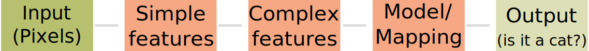

Deep layers acts as both model and feature detectors

---

### Hierarchical feature representaion 
Deep neural networks learn larger and more abstract features deeper into the network.

<object type="image/svg+xml" data="assets/img/convolution-hierachy.svg" style="background: white; width: 60%; height: auto;">
</object>


---

### Why use Deep Networks 
Why is this important? 

Imagine trying to convert our cat detector to a car detector:


With DL, just supply a different dataset! <!-- .element: class="fragment" -->

---

### DL performance 

DL is able to use **more** data to increase performance 


<div>
... but also means you need <strong>more</strong> data to train DL algorithms
</div>

---

### DL Frameworks

Many DL frameworks are available, most popular being:

* [Tensorflow](https://www.tensorflow.org/)
  * The easiest framework to use (Keras)
  * Fast
* [PyTorch](https://pytorch.org/)
  * Dynamic network graph
  * Network debuggable
  

---

# Neural Networks

---

### Lesson contents

* What are neural networks?
* How Neural networks learn
* How to train neural networks

---

### Artificial Neural Networks 

Artificial neural networks are inspired by biological neural networks found in animal brains.

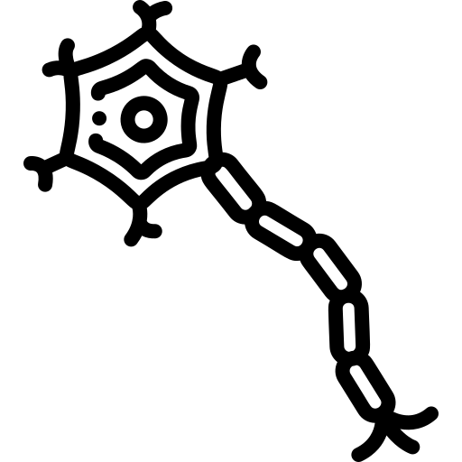


---

### An artificial neuron
Behaviour is simplified compared to their biological counterparts...


Inputs ($x_{n}$) are multiplied with weights ($w_{n}$) and summed together with the bias ($b$).


Note:
Based on the principle that neurons that fire together, wire together
- Weights are an indication of how strong a connection is
- Bias is a general indication of how active a particular node is

The weights and biases determine how neurons are activated and the signal passes through the network

---

### An artificial neuron
Behaviour is simplified compared to their biological counterparts...


$$
x_{1}w_{1}+x_{2}w_{2}+x_{3}w_{3}+b=y
$$


---

### A Neural Network
A neural network is simply a network of (artificial) neurons with distinct layers. 


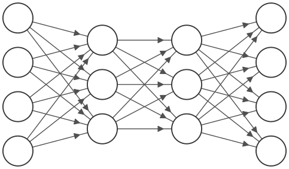

Note:
Each neuron is connected to all neurons in the previous layer
---

### A Neural Network

The network is `acyclic`. Data is fed into the `Input` layer and prediction comes out at the `Output` layer. 
Any layer in-between is called the `Hidden` layer.


<object type="image/svg+xml" data="assets/img/neuralnetwork-term.svg" style="background: white; width: 50%; padding: 1em">
<param id="layer2" class="fragment" data-fragment-index="1" />
<param id="layer3" class="fragment" data-fragment-index="2" />
<param id="layer4" class="fragment" data-fragment-index="4" />
<param id="layer5" class="fragment" data-fragment-index="3" />
</object>

---


### Network inputs

One scalar value per node

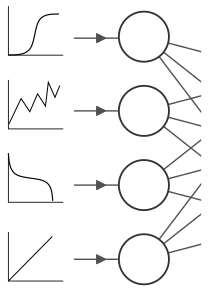

---

### Network inputs

One scalar value per node... e.g. house price features

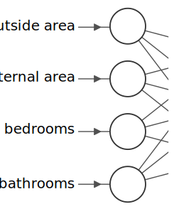


---

### Network inputs

Or images, one node per pixel (greyscale)

<object type="image/svg+xml" data="assets/img/neuralnetwork-input3.svg" style="background: white; width: 50%; padding: 1em">
<param id="layer1" class="fragment" data-fragment-index="1" />
<param id="layer2" class="fragment" data-fragment-index="2" />
<param id="layer3" class="fragment" data-fragment-index="3" />
</object>

---

### Network inputs

You can also think of images as a grid of input nodes.

<object type="image/svg+xml" data="assets/img/neuralnetwork-input4.svg" style="background: white; width: 80%; padding: 1em">

<param id="layer6" class="fragment" data-fragment-index="2" />
</object>

---

### Network inputs

What about colour images?

---

### Network inputs

What about colour images?

<object type="image/svg+xml" data="assets/img/neuralnetwork-input5.svg" style="background: white; width: 80%; padding: 1em">
<param id="layer2" class="fragment fade-in-then-semi-out" data-fragment-index="2" />
<param id="layer3" class="fragment fade-in" data-fragment-index="3" />
</object>


For RGB images, no. of input nodes are  `$ width*height*channels $` 
<!-- .element: class="fragment" -->

---

### Network outputs

One scalar value per output node, e.g. house price prediction.

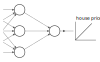


---

### Network outputs

When performing classification, we need one output node per category.

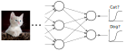

---

### Inference
* Input values at $x_{1...n}$ on the left
* Propagate values layer-by-layer <!-- .element: class="fragment" data-fragment-index="1" -->
* Output the prediction ($\hat{y}$). 
  <!-- .element: class="fragment" data-fragment-index="3" -->


<object type="image/svg+xml" data="assets/img/neuralnetwork-inference.svg" style="background: white; width: 80%; margin-top: 1em">
<param id="layer2" class="fragment fade-in" data-fragment-index="1" />
<param id="layer3" class="fragment fade-in" data-fragment-index="2" />
<param id="layer4" class="fragment fade-in" data-fragment-index="3" />
</object>

Note:

---

### Initialising the network
* One weight $w$ per connection, one bias $b$ per node.
    <!-- .element: class="fragment" -->
* Weights $w$ and bias $b$ start out random.
  <!-- .element: class="fragment" -->
* You'll likely find that your initial prediction $\hat{y}$ will be very different from your label $y$.
<!-- .element: class="fragment" -->

<object type="image/svg+xml" data="assets/img/neuralnetwork-initialisation.svg" style="background: white; width: 80%; margin-top: 1em">
</object>

---

### Error and Loss

We need a way good way to quantify how far our prediction is from our goal.

<object type="image/svg+xml" data="assets/img/neuralnetwork-initialisation.svg" style="background: white; width: 80%; margin-top: 1em">
</object>

Note:
a way of telling our computer that it's wrong and how it should be corrected.
---

### Error and Loss

Why don't we just use absolute difference, the `Error` ($E$) between the prediction ($\hat{y}$) and target ($y$)? 

In this case  $E = y - \hat{y} = -75$
 

<object type="image/svg+xml" data="assets/img/neuralnetwork-initialisation.svg" style="background: white; width: 80%; margin-top: 1em">
</object>

Note:
This is the cost of a single training example. During training we will actually calculate the average cost across the thousands of available training examples.

---

### Error and Loss

Let's simplify our example to a 2 node network:

<object type="image/svg+xml" data="assets/img/neuralnetwork-2node.svg" style="background: white; width: auto; height: auto; margin-top: 1em">
</object>

We get an equation for a straight line: <!-- .element: class="fragment" data-fragment-index="1"--> 

$$
\hat{y} = x_1w+b
$$
<!-- .element: class="fragment" data-fragment-index="1"-->

We can adjust the weight ($w$) and bias ($b$) to change the output of our function.
<!-- .element: class="fragment" -->

---

### Error and Loss

Let's try to fit to this dataset

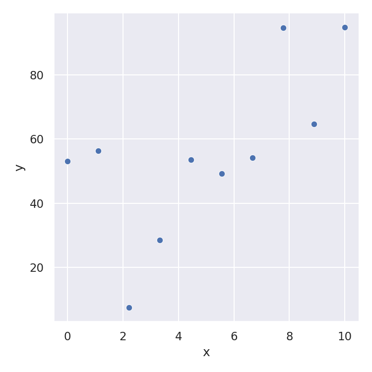

---

### Error and Loss

* We start off with random weights ($w$) and bias ($b$). In this case $w = 8$ and $b = 3$.
* The number next to the target is the `error` ($y - \hat{y}$) for that sample.

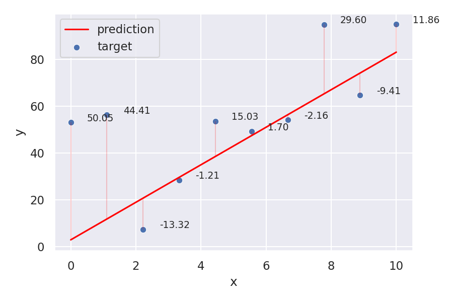

---

### Error and Loss

We want to find the average of all our errors, but simply summing them up $\(E =\frac{1}{m}\sum^m(y-\hat{y})\)$ means negative errors negate the positive.  
$m=$ number  of  samples.

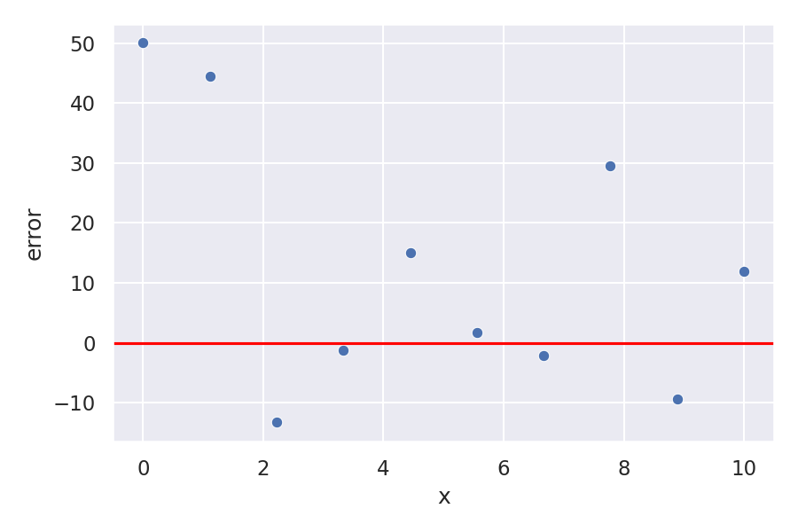

---

### Loss functions

Let's square all of our errors so they're all positive $L(y,\hat{y}) =\frac{1}{m}\sum^m(y-\hat{y})^2$.

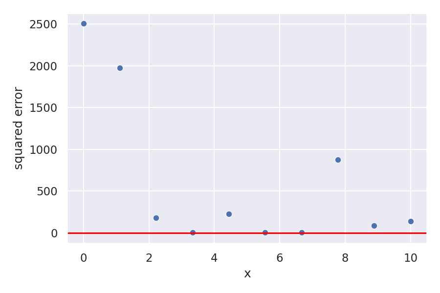


---

### Loss functions

$L(y,\hat{y}) =\frac{1}{m}\sum^m(y-\hat{y})^2$

We've created a `Loss` (or `Cost`) function to help us better quantify our error. This particular one is called `mean squared loss`.
* All errors are $+ve$, we're trying to reduce to $0$.
* Error grows exponentially with distance from target.

---

### Minimising Loss

For $w = 8$ and $b = 3$, our loss is $L(y,\hat{y}) = 599.41$. 


Note:
This is the cost across all training examples and is a measure of how our model is performing across our entire dataset.

But just telling our model how bad it is perfomring is not much use. We need to be able to tell it how to adjust it's weights and biases to do better
---

### Minimising Loss

Let's decrease $w$ from $8$ to $7$, the loss increases to $L(y,\hat{y}) = 703.16$. 

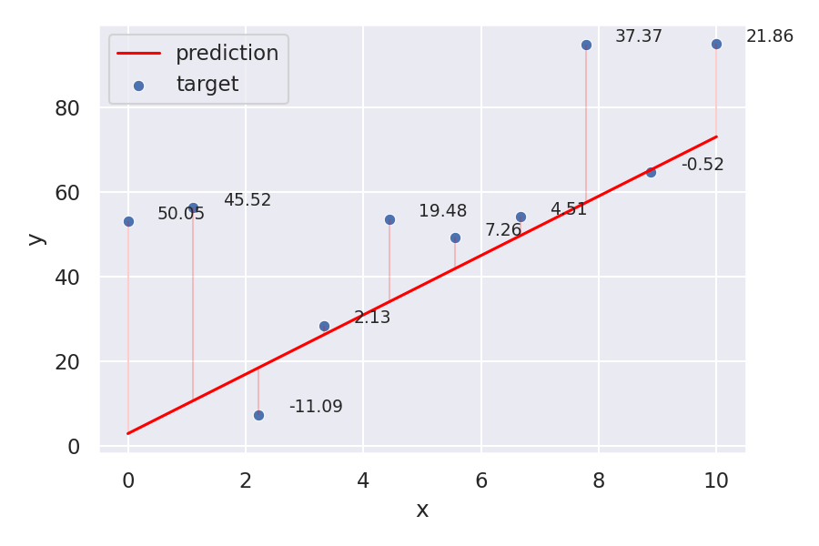

---

### Minimising Loss

Let's instead increase $w$ from $8$ to $9$, the loss decreases to $L(y,\hat{y}) = 566.05$. 

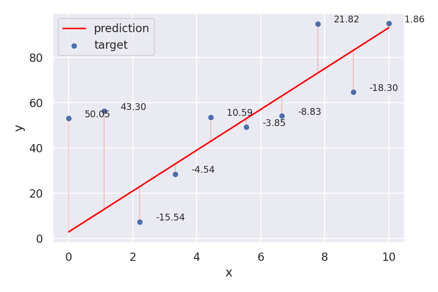

Looks like we're going in the right direction!

---

### Minimising Loss

We can explore the loss values by plotting for a range of $w$. 

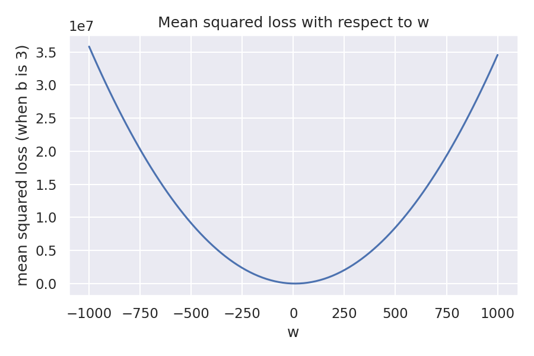

---

### Minimising Loss

And for a range of $b$. 

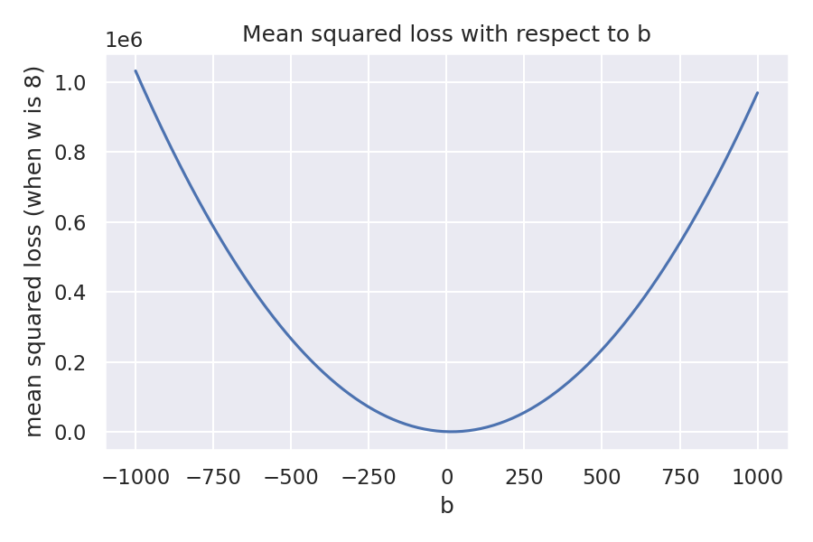

---

### Minimising Loss

To get the entire picture we need to look at $w$ and $b$ at the same time. 

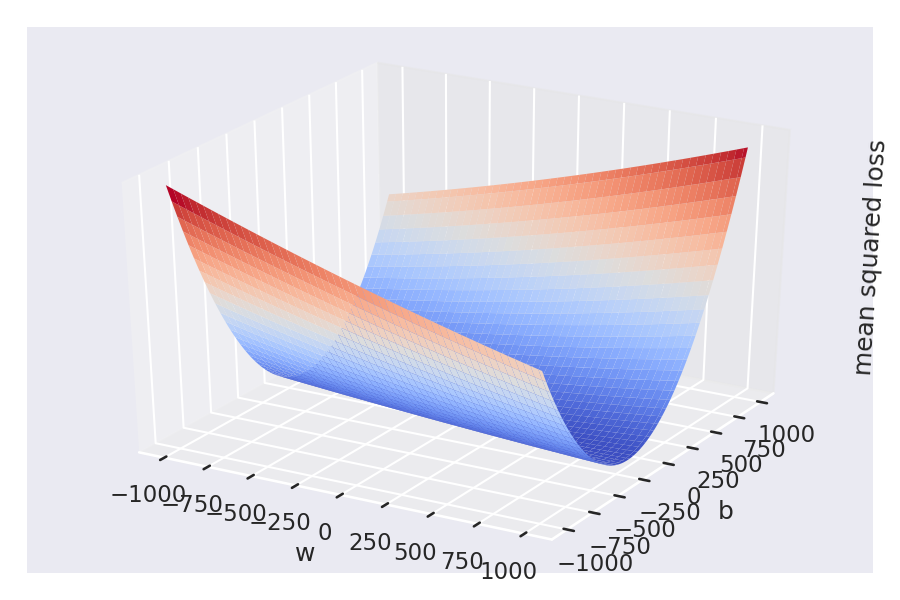


Note:
This is what machine learning really is about, it's a calculus exercise in finding a minimum, a minimum is a loss or cost function.

This however won't work with more features or a more complicated cost surface. So what we can do is, beginning with our random parameter values, calculate the direction in which the weights should be adjusted to reduce the cost.


---


### Gradient descent

Descending through the loss surface by gradually changing the `weights` and `biases`.

<object type="image/svg+xml" data="assets/img/gradient-descent3d.svg" style="background: white; width: 80%; margin-top: 1em">
<param id="layer2" class="fragment fade-in" data-fragment-index="1" />
<param id="layer3" class="fragment fade-in" data-fragment-index="2" />
<param id="layer4" class="fragment fade-in" data-fragment-index="3" />
<param id="layer5" class="fragment fade-in" data-fragment-index="4" />
<param id="layer6" class="fragment fade-in" data-fragment-index="5" />
<param id="layer7" class="fragment fade-in" data-fragment-index="6" />
<param id="layer8" class="fragment fade-in" data-fragment-index="7" />
</object>

Note:

We do this by calculating the gradient direction for each parameter and taking a step in the downhill direction.
---

### Gradient descent
Perform differentiation of our weight or bias with respect to the loss. 

$\frac{{\delta}L}{{\delta}w^l_k}$ or $\frac{{\delta}L}{{\delta}b^l_k}$ 


---

### Gradient descent

We then move step-by-step towards negative gradient with learning rate hyperparameter $\eta$.

$w^l_k = w^l_k -\eta{\nabla}L(w^l_k)$


Note:
- Batch gradient descent can be very slow and is intractable for datasets that don't fit in memory. Batch gradient descent also doesn't allow us to update our model online, i.e. with new examples on-the-fly.
- updates the parameters in the opposite direction of the gradient of the objective function ∇θJ(θ) w.r.t. to the parameters.
---

### Terminology: Hyperparameters

Parameters used to control the learning process, e.g.:

* Learning rate ($\eta$)
* Batch size
* Number of training epochs

---

### Learning rate

Too large learning rate ($\eta$) can miss the minima and the cause the network to diverge.


---

### Learning rate

Too small learning rate $\eta$ means our network takes longer to converge.

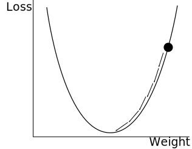

---

### Learning rate

How do we know the 'optimal' learning rate?

We won't know until actually training the network! <!-- .element: class="fragment" -->

Start with the default values provided. <!-- .element: class="fragment" -->

Perform analysis on rate of convergence during training.<!-- .element: class="fragment" -->

---

### Back propagation

<object type="image/svg+xml" data="assets/img/neuralnetwork-backprop.svg" style="background: white; width: 80%; margin-top: 1em">
<param id="layer2" class="fragment fade-in" data-fragment-index="1" />
<param id="layer3" class="fragment fade-in" data-fragment-index="2" />
<param id="layer4" class="fragment fade-in" data-fragment-index="3" />
</object>

Note:
In backpropagation, each of the neural network's weights receives an update proportional to the partial derivative of the error function with respect to the current weight in each iteration of training

It's importnat to remember that the cost function involves taking the average across ALL training data which means the network is adjusted to fit better to the entire dataset.

The algorithm for computing the gradients efficiently and adjusting the weights and bias updates is called backpropagation.
---

### Neural Network Training Cycle

<object type="image/svg+xml" data="assets/img/neuralnetwork-training.svg" style="background: white; width: 50%">
<param id="layer2" class="fragment" data-fragment-index="2" />
<param id="layer3" class="fragment" data-fragment-index="3" />
<param id="layer4" class="fragment" data-fragment-index="4" />
<param id="layer5" class="fragment" data-fragment-index="5" />
<param id="layer6" class="fragment" data-fragment-index="6" />
<param id="layer7" class="fragment" data-fragment-index="7" />
<param id="layer8" class="fragment" data-fragment-index="8" />
<param id="layer9" class="fragment" data-fragment-index="9" />
</object>

---

### Neural Network Training Cycle

1. Forward propagation - Pass in data from sample
1. Calculate loss - compare prediction with target
1. Back propagation - find gradients for each weight and bias
1. Repeat for all samples
1. Average gradients of weights and bias then update <!-- .element: class="fragment" -->
1. Start again from 1 <!-- .element: class="fragment" -->

---

### Stochastic gradient descent

Gradient descent calculate the loss of the entire dataset at every step. 

By randomising our training data, training in small `batches` still gets a good approximation of the entire dataset. 
This allows our model to converge faster.

Note:
A true gradient descent requires performing backpropagation on ALL data.
- However this is computationally very expensive.
- What happens most commonly is that we randomly shuffle our data into smaller batches and perform propagation on each batch
- This speeds up the process. It does however mean that the gradient descent direction might be a bit more convoluted as each batch is less representative of the whole dataset. 
- gradient descent also is known as batch gradient descent.
- Gradient descent computes the gradient of the cost function w.r.t. to the parameters θ for the entire training dataset, Stochastic one performs a parameter update for each training example, and mini-batch gradient descent update for every mini-batch of n training examples
- SGD performs one update at a time. It is therefore usually much faster and can also be used to learn online. SGD performs frequent updates with a high variance that cause the objective function to fluctuate heavily and therefore is noisy.
---

### Stochastic gradient descent (batch size = 2)

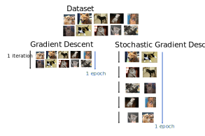

Note:

- iteration: a single batch is passed through the network
- epoch: hte full dataset has passed through the network
---

### Stochastic gradient descent


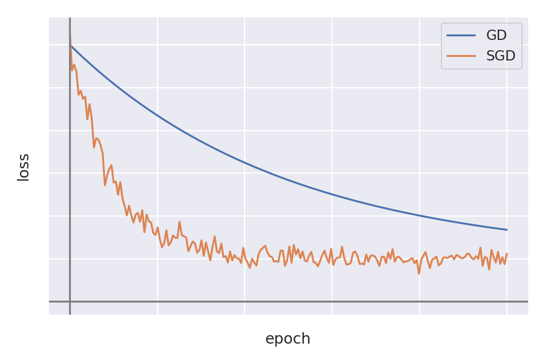


---

### Batch size

Number of samples our network can train on at the same time.

* Larger batch size gives a better approximation of the entire dataset but uses more memory and processing power.
* Smaller batch size adds noise to our network, this actually helps the model generalise better.
* Normally set in 10s or 100s, e.g. 32 or 64 are popular sizes.

---

### Terminology: Iterations and Epochs

1 **epoch** is when we've gone through the **entire** dataset

1 **iteration** is when we've gone through the number of samples in a **batch** 

e.g. if our entire dataset is **100** samples and our **batch** size is **5**

**1** **epoch** equals **20** **iterations**

---

### To resume training your model

The network's finished training for 10 epochs and still hasn't converged? 

Your `model` retains its weights and the `fit` function can be called again to do further training.

---

### Datasets

Three types of datasets:

* **Training** dataset- Our model learns from **only** this dataset.
* **Validation** dataset - Used to check and fine-tune model's performance and generalisability.
* **Test** dataset - Used to check the performance of a **fully trained** model. Don't peek!

---

### Validation datasets

It's not unusual to not be provided with a **validation** dataset. 

* Randomise and split a portion from your **training** dataset.
* Or perform a **k-folds** cross-validation.

---

### K-folds cross validation

Split dataset into $k$ parts, validate with one part and train on the rest. Repeat $k$ times using a different part to validate.

<object type="image/svg+xml" data="assets/img/kfolds.svg" style="background: white; width: 40%; height: auto;">
</object>

---

### Optimizers

SGD is inherently noisy, optimizers can be used to get closer to the ideal descent path and increase our convergence rate.

<object type="image/svg+xml" data="assets/img/gradient-descent-sgd3d.svg" style="background: white; width: 80%">
<param id="layer2" class="fragment" data-fragment-index="2" />
</object>

---

### Optimizers
* `Momentum` - Accumulates gradient of previous steps to provide pushing `force` in the accumulated direction.
* `RMSProp` - Adapt learning rate for each parameter, larger gradients gets smaller updates, dampening the sideways oscillation.
* `Adam` - a combination of `Momentum` and `RMSProp`.

Note:
- Gradient descent based optimization algorithms
---

### Activation functions

As it is, our network can only map to a linear function.

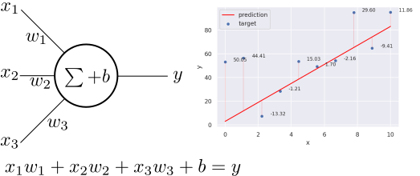

It's great for linear regression!

---

### Activation functions

But most real-world problems are non-linear.

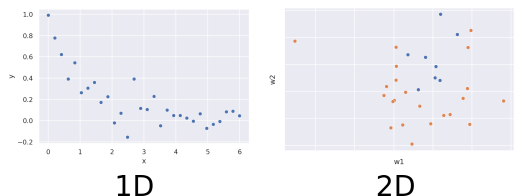

---

### Activation functions

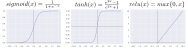

ReLU is more computationally efficient and doesn't suffer from `vanishing gradient` but can 'die' when input is negative.

Note:
In machine learning, the vanishing gradient problem is encountered when training artificial neural networks with gradient-based learning methods and backpropagation. The problem is that in some cases, the gradient will be vanishingly small, effectively preventing the weight from changing its value. In the worst case, this may completely stop the neural network from further training

- sigmoid is useful for probabilies and used in binary classification while similar softmax activation is used for multiclass classification problems

---

## Lab 01: Classifying images of clothing
Classification with neural networks.

---

# Classification

---

### Lesson contents

* Classification with neural networks
  * Logistic regression and softmax  
  * Cross entropy loss
  * One-hot encoding

---

### Classification

Logistic regression - the output is a confidence probability between $0$ (false) and $1$ (true).


---


### Classification

One output node per category.

<object type="image/svg+xml" data="assets/img/neuralnetwork-output2.svg" style="background: white; width: 70%; height: auto;">
</object>

---

### Classification outputs
For two categories, we an output vector size of **2**. Since its probabilities, we want the output vector to sum up to $1.0$.

<object type="image/svg+xml" data="assets/img/classification-onehot-probabiitysum.svg" style="background: white; width: 70%; height: auto;">
<param id="layer2" class="fragment" data-fragment-index="1" />
</object>

---

### Softmax
Bound output between $0$ and $1$ with **sigmoid** and **normalise** so output vector sums up to $1$.

<object type="image/svg+xml" data="assets/img/classification-softmax.svg" style="background: white; width: 70%; height: auto;">
</object>

---

### Classification labels

So what should our **labels/targets** look like?

<object type="image/svg+xml" data="assets/img/classification-onehot-cat.svg" style="background: white; width: 70%; height: auto;">
<param id="layer2" class="fragment" data-fragment-index="1" />
</object>

---

### Classification labels

What would be the **target** if we're classifying a dog?

<object type="image/svg+xml" data="assets/img/classification-onehot-dog.svg" style="background: white; width: 70%; height: auto;">
<param id="layer2" class="fragment" data-fragment-index="1" />
</object>

---

### One-hot encoding
Encode categories into vector form. Only **one** category should be **true**, hence **one-hot**.

<object type="image/svg+xml" data="assets/img/classification-onehot-3class.svg" style="background: white; width: 70%; height: auto;">
</object>


---

### Cross Entropy Loss

Larger penalty for classifying the wrong category.

```python
def get_entropy_loss(y, y_hat):
  if y ==1 :
    # Target is true
    return -math.log(y_hat)
  else:
    # Target is false
    return -math.log(1-y_hat)
```

Note: 
- Cross-entropy is used to measure the difference between two probability distribution p and q. 
- H(p,q) = - \Sum p(x) log q(x)
- In information theory, “surprise” of an event is used. An event is more surprising the less likely it is, meaning it contains more information.
- Low Probability Event (surprising): More information.
- Higher Probability Event (unsurprising): Less information.
- Skewed Probability Distribution (unsurprising): Low entropy.
- Balanced Probability Distribution (surprising): High entropy.

---

### Cross Entropy Loss

Larger penalty for classifying the wrong category.


---

### Cross Entropy Loss vs Squared Loss

Larger penalty for classifying the wrong category.


---

### Cross Entropy Loss

Several types of cross entropy loss available in `tf.keras`:

* **BinaryCrossentropy** - When there's **only** 2 labels, expects **one-hot** labels.
* **CategoricalCrossentropy** - When there's **2 or more** labels, expects **one-hot** labels.
* **SparseCategoricalCrossentropy** - When there's **2 or more** labels, expects **single integer** labels representing category.

---

# Refining the model

---

### Lesson contents

* Visualising the model's performance
* Strategies to prevent underfitting and overfitting
* Data augmentation

---

