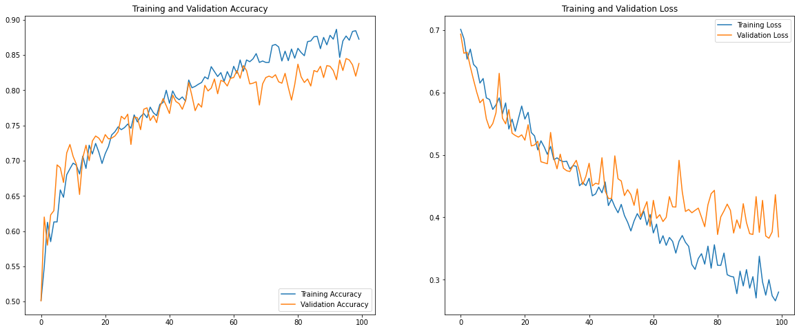
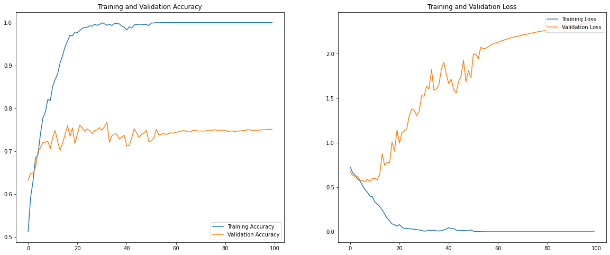
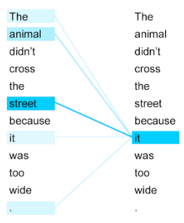

# Introduction to Deep Learning With Tensorflow Keras: 

# Part 2

Twin Karmakharm & Fariba Yousefi

---

<!-- .slide: data-background="assets/img/rse-logo.svg" -->
<!-- .slide: data-background-opacity="0.2" -->

### Research Software Engineering Sheffield

* Increasing research impact through software
* Support and consultancy in research software and systems development and maintenance
    * Grant support
* Software optimisation, GPU and HPC
* Training, outreach and education activities
* Led by Dr. Paul Richmond
* Visit us at [https://rse.shef.ac.uk](https://rse.shef.ac.uk)

---

### Course Materials

All course materials can be found at:

[https://rses-dl-course-durham.github.io/](https://rses-dl-course-durham.github.io/)

---

### Course Schedule

* **10:00-11:30** | 01: Introduction to Deep Leaning and Neural Networks
* **12:00-13:30** | 02: Convolution, Refining the model & Transfer Learning
  
---

# Convolutional Neural Networks

---

### Lesson contents

* The convolution layer
* The max-pooling layer

---

### Hierarchical feature representaion 
Deep neural networks learn larger and more abstract features deeper into the network.

<object type="image/svg+xml" data="assets/img/convolution-hierachy.svg" style="background: white; width: 60%; height: auto;">
</object>

---

### Building a deep network

Stack layers between `Input` and `Output` layers. 

<object type="image/svg+xml" data="assets/img/neuralnetwork-term.svg" style="background: white; width: 50%; padding: 1em">
<param id="layer2" class="fragment" data-fragment-index="1" />
<param id="layer3" class="fragment" data-fragment-index="2" />
<param id="layer4" class="fragment" data-fragment-index="4" />
<param id="layer5" class="fragment" data-fragment-index="3" />
</object>

---

### Fully connected/Dense layers

Each node in layer is connected to **every node** in the **previous** layer.

<object type="image/svg+xml" data="assets/img/convolution-dense2.svg" style="background: white; width: auto; height: auto;">
<param id="layer2" class="fragment" data-fragment-index="1" />
</object>

---

### Convolution Layer

<object type="image/svg+xml" data="assets/img/convolution-1d.svg" style="background: white; width: auto; height: auto;">
<param id="layer3" class="fragment " data-fragment-index="1" />
<param id="layer2" class="fragment fade-in-then-out" data-fragment-index="2" />
<param id="layer4" class="fragment fade-in-then-out" data-fragment-index="3" />
<param id="layer5" class="fragment fade-in-then-out" data-fragment-index="4" />
</object>

---

### Convolution Layer

* Each layer can have multiple filters (feature detectors)
* Each filter detects a single feature across the entire input space
  * `Kernel size` and `stride` used to control the convolution process
  * Same weights used for each filter
* Each node only connects to a subset of nodes in the previous layer
---

### Convolution in 2D

We arrange our input nodes as a grid to match our input image.

<object type="image/svg+xml" data="assets/img/convolution-gridinput.svg" style="background: white; width: auto; height: auto;">
<param id="layer1" class="fragment fade-out" data-fragment-index="1" />
<param id="layer2" class="fragment fade-in-then-out" data-fragment-index="1" />
<param id="layer3" class="fragment fade-in-then-out" data-fragment-index="2" />
</object>

---

### Convolution in 2D

Here's an example of a smaller convolution network (LeNet).

<object type="image/svg+xml" data="assets/img/lenet2.svg" style="background: white; width: 90% !important; height: auto;">
</object>

Each convolution layer has a number of filters, their outputs are represented as stacks of images.

---

### The convolution process

Scan filter of `kernel size` over the image with the step length of `stride`. It also determines the dimensions of the `output`.

<object type="image/svg+xml" data="assets/img/convolution-process.svg" style="background: white; width: auto; height: auto;">
<param id="layer2" class="fragment fade-in-then-out" data-fragment-index="2" />
<param id="layer3" class="fragment fade-in-then-out" data-fragment-index="3" />
<param id="layer4" class="fragment fade-in-then-out" data-fragment-index="4" />
<param id="layer5" class="fragment fade-in-then-out" data-fragment-index="5" />
<param id="layer6" class="fragment fade-in-then-out" data-fragment-index="6" />
<param id="layer7" class="fragment fade-in-then-out" data-fragment-index="7" />
<param id="layer8" class="fragment fade-in-then-out" data-fragment-index="8" />
<param id="layer9" class="fragment fade-in-then-out" data-fragment-index="9" />
<param id="layer10" class="fragment fade-in-then-out" data-fragment-index="10" />
</object>

---

### The convolution process

The output pixel is the weighted sum of the scanned area. The maths is the same as when connecting nodes together except the weight sharing!

<object type="image/svg+xml" data="assets/img/convolution-process-nodes.svg" style="background: white; width: auto; height: auto;">
<param id="layer2" class="fragment fade-in-then-out" data-fragment-index="2" />
<param id="layer3" class="fragment fade-in-then-out" data-fragment-index="3" />
<param id="layer4" class="fragment fade-in-then-out" data-fragment-index="4" />
<param id="layer5" class="fragment fade-in-then-out" data-fragment-index="5" />
<param id="layer6" class="fragment fade-in-then-out" data-fragment-index="6" />
<param id="layer7" class="fragment fade-in-then-out" data-fragment-index="7" />
<param id="layer8" class="fragment fade-in-then-out" data-fragment-index="8" />
<param id="layer9" class="fragment fade-in-then-out" data-fragment-index="9" />
<param id="layer10" class="fragment fade-in-then-out" data-fragment-index="10" />
</object>

---

### The convolution process

Filter weights remains the same as it scan over the image. It's detecting a single feature e.g. a vertical line.

<object type="image/svg+xml" data="assets/img/convolution-process-nodes.svg" style="background: white; width: auto; height: auto;">
<param id="layer2" class="fragment fade-in-then-out" data-fragment-index="2" />
<param id="layer3" class="fragment fade-in-then-out" data-fragment-index="3" />
<param id="layer4" class="fragment fade-in-then-out" data-fragment-index="4" />
<param id="layer5" class="fragment fade-in-then-out" data-fragment-index="5" />
<param id="layer6" class="fragment fade-in-then-out" data-fragment-index="6" />
<param id="layer7" class="fragment fade-in-then-out" data-fragment-index="7" />
<param id="layer8" class="fragment fade-in-then-out" data-fragment-index="8" />
<param id="layer9" class="fragment fade-in-then-out" data-fragment-index="9" />
<param id="layer10" class="fragment fade-in-then-out" data-fragment-index="10" />
</object>

---

### Convolution with multiple filters

Scan through the entire image again with a different filter for detecting a different feature, e.g. for a horizontal line.

<object type="image/svg+xml" data="assets/img/convolution-process-multifilter.svg" style="background: white; width: auto; height: auto;">
<param id="layer2" class="fragment fade-in-then-out" data-fragment-index="2" />
<param id="layer3" class="fragment fade-in-then-out" data-fragment-index="3" />
<param id="layer4" class="fragment fade-in-then-out" data-fragment-index="4" />
<param id="layer5" class="fragment fade-in-then-out" data-fragment-index="5" />
<param id="layer6" class="fragment fade-in-then-out" data-fragment-index="6" />
<param id="layer7" class="fragment fade-in-then-out" data-fragment-index="7" />
<param id="layer8" class="fragment fade-in-then-out" data-fragment-index="8" />
<param id="layer9" class="fragment fade-in-then-out" data-fragment-index="9" />
<param id="layer10" class="fragment fade-in-then-out" data-fragment-index="10" />
</object>

---

### Convolution with multiple filters

With multiple filters you'll get a 3D output `[filters, width, height]`.

<object type="image/svg+xml" data="assets/img/convolution-process-multifilter.svg" style="background: white; width: auto; height: auto;">
<param id="layer2" class="fragment fade-in-then-out" data-fragment-index="2" />
<param id="layer3" class="fragment fade-in-then-out" data-fragment-index="3" />
<param id="layer4" class="fragment fade-in-then-out" data-fragment-index="4" />
<param id="layer5" class="fragment fade-in-then-out" data-fragment-index="5" />
<param id="layer6" class="fragment fade-in-then-out" data-fragment-index="6" />
<param id="layer7" class="fragment fade-in-then-out" data-fragment-index="7" />
<param id="layer8" class="fragment fade-in-then-out" data-fragment-index="8" />
<param id="layer9" class="fragment fade-in-then-out" data-fragment-index="9" />
<param id="layer10" class="fragment fade-in-then-out" data-fragment-index="10" />
</object>

---

### Stacking convolution layers

Separate kernel for each input channel then sum its output matrices together. Repeat for the next filter.

<object type="image/svg+xml" data="assets/img/convolution-process-multichannel.svg" style="background: white; width: auto; height: auto;">
<param id="layer2" class="fragment fade-in-then-out" data-fragment-index="2" />
<param id="layer3" class="fragment fade-in-then-out" data-fragment-index="3" />
<param id="layer4" class="fragment fade-in-then-out" data-fragment-index="4" />
<param id="layer5" class="fragment fade-in-then-out" data-fragment-index="5" />
<param id="layer6" class="fragment fade-in-then-out" data-fragment-index="6" />
<param id="layer7" class="fragment fade-in-then-out" data-fragment-index="7" />
<param id="layer8" class="fragment fade-in-then-out" data-fragment-index="8" />
<param id="layer9" class="fragment fade-in-then-out" data-fragment-index="9" />
<param id="layer10" class="fragment fade-in-then-out" data-fragment-index="10" />
</object>

---

### Padding

Add padding to not lose details on the edges. Tensorflow's `same` padding automatically determine the amount of padding 
so that output size is same as input (if stride is 1).

<object type="image/svg+xml" data="assets/img/padding.svg" style="background: white; width: 30%; height: auto;">
</object>

---

### Max-pooling

Select the maximum number in the current kernel, used mainly for subsampling, reducing the overall network size.

<object type="image/svg+xml" data="assets/img/maxpool.svg" style="background: white; width: 60%; height: auto;">
</object>

---

### Putting it all together

We already know how to create dense networks, it's just a matter of adding `Convolution` and `Max pooling` layers!

<object type="image/svg+xml" data="assets/img/lenet2.svg" style="background: white; width: 90% !important; height: auto;">
</object>

---

## Lab 02: Image classification with CNNs

---

# Refining the model

---

### What do we want to improve about our model?
* Accuracy
* Generalisability
* Training time 

---

### Refresh: Datasets

Three types of datasets:

* **Training** dataset- Our model learns from **only** this dataset.
* **Validation** dataset - Used to check and fine-tune model's performance and generalisability.
* **Test** dataset - Used to check the performance of a **fully trained** model. Don't peek!

---

### Refresh: Validation datasets

It's not unusual to not be provided with a **validation** dataset. 

* Randomise and split a portion from your **training** dataset.
* Or perform a **k-folds** cross-validation.

---

### Measuring the model's performance

The trend of `Loss`, our measure of error, should decrease and `Accuracy` increase as the model trains.

This should happen for **both** `training` and `validation` datasets.

---

## Visualising Loss and Accuracy

Here's a loss and accuracy plots of the `training` and `validation` datasets.

---

### Confusion matrix
  
The confusion matrix visualises predicted classes against the actual label. A good way to highlight problems
in specific classes.

<object type="image/svg+xml" data="assets/img/confusion-matrix.svg" style="background: white; width: auto; height: auto;">
<param id="layer2" class="fragment fade-in-then-out" data-fragment-index="1" />
<param id="layer3" class="fragment fade-in-then-out" data-fragment-index="2" />
</object>

---

### Fitting model to data

A well fitted model generalises well.

<object type="image/svg+xml" data="assets/img/data-fitting.svg" style="background: white; width: 80%; height: auto;">
</object>

---

### Underfitting

<object type="image/svg+xml" data="assets/img/data-fitting.svg" style="background: white; width: 80%; height: auto;">
</object>

Model not learning the function, training loss not decreasing.

Try increasing the model size or complexity, e.g. add nodes, layers or activation functions. <!-- .element: class="fragment" -->

---

### Overfitting

<object type="image/svg+xml" data="assets/img/data-fitting.svg" style="background: white; width: 80%; height: auto;">
</object>

Model learns the data too well and doesn't generalise. Training loss decreases but Validation loss increases. 
This is a big problem in DL!

---

### Overfitting

Model learns the data too well and doesn't generalise. Training loss decreases but Validation loss increases. 
This is a big problem in DL!

---

### Strategies to reduce overfitting

Strategies normally involves adding some kind of regularisation either to the network or the dataset.

* Reducing batch size - adds more noise every step.
* Reducing model size - so that model can't just 'remember' the dataset.
* Adding regularisation to the network e.g.:
  * L2 and L1 regularisation
  * Dropout
  * Batch normalisation
* Early stopping
* Data augmentation

Note:
The regularization term, or penalty, imposes a cost on the optimization function for overfitting the function or to make the optimal solution unique.
- L1: lasso regression
- L2 :  ridge regression. 
---

### Dropout

Randomly disable a percentage of inputs into the layer with the `rate` parameter. 

<object type="image/svg+xml" data="assets/img/dropout.svg" style="background: white; width: auto; height: auto;">
</object>

---

### Batch Normalisation

Normalising your dataset helps to smooth the loss surface and makes gradient descent faster. Batch normalisation follows
the same principle but the normalisation is done on a layer's output for each batch instead.

<object type="image/svg+xml" data="assets/img/normalisation.svg" style="background: white; width: 80%; height: auto;">
</object>

Note:
Batch normalization is a technique for training very deep neural networks that standardizes the inputs to a layer for each mini-batch. 

This has the effect of stabilizing the learning process and dramatically reducing the number of training epochs required to train deep networks.
---

### When do we stop training?

How many epochs should we train the model?

Like other hyperparameters, we won't know until we've started training.
<!-- .element: class="fragment" -->

But don't wait until your loss is $0$! 
<!-- .element: class="fragment" -->

---

### Early stopping

Stop as your `validation` loss starts to diverge. Your `validation` accuracy will also stop increasing or decrease at the time.

If the performance is good enough then the model can be used as-is.

<object type="image/svg+xml" data="assets/img/early-stop.svg" style="background: white; width: 50%; height: auto;">
</object>

---

## Refining your dataset

---

### How good is your data?

A good dataset is essential for getting good results! 
* Is it representative of real-world inputs?
  * Are there enough categories and what's the variance for each category?
* Is there enough data?
  * DL is especially data hungry and normally requires 100+ samples per category.
* Is your data clean?
  * Incorrect values, missing fields, duplicated entries, etc.

  
---

### How good is your data?

* Is your dataset balanced?
  * Ideal dataset has equal no. samples per category.
* Is there human bias in your dataset?
  * Can lead to many ethical concerns.

---

### Normalising inputs

It's important to normalise your features! It helps create a smoother loss surface and allow your network to train faster.

<object type="image/svg+xml" data="assets/img/normalisation.svg" style="background: white; width: 80%; height: auto;">
</object>

---

### Normalising inputs

Especially when there are big differences between the magnitude of your features e.g.:
* no. of bedrooms  1s-10s
* floor area ($m^2$) 100s-1000s
* house price (£) 100,000s-1,000,000s

<object type="image/svg+xml" data="assets/img/normalisation.svg" style="background: white; width: 80%; height: auto;">
</object>

---

### Don't forget to transform **all** of your inputs

Apply the same transformations e.g. normalisation, mean-shifting to all data coming in to your network 
and not just on the training set.

Pre-trained models should specify its transformations.

---

### Data Augmentation

Generating synthetic data from existing data in order to increase the size of your dataset. 
Helps increase generalisability and reduce overfitting.  

---

### Data Augmentation - Example transformations

<object type="image/svg+xml" data="assets/img/data-augmentation.svg" style="background: white; width: 80%; height: auto;">
</object>

---

### Feature selection

Not every feature has to be added to the network. Could you remove, combine or transform some features? 
ML feature engineering rules still apply!

---

## Lab 03 a & b: Data augmentation on dogs & cats dataset

---

# Transfer Learning

---

### Transfer Learning 
Deep neural networks learn larger and more abstract features deeper into the network.

<object type="image/svg+xml" data="assets/img/convolution-hierachy.svg" style="background: white; width: 60%; height: auto;">
</object>

---

### Transfer Learning 
The learned features can be re-used in a different classifier.

<object type="image/svg+xml" data="assets/img/transfer-convolution-hierachy.svg" style="background: white; width: 60%; height: auto;">
</object>

---

### Transfer learning

Pre-trained models can be obtained from places such as [Tensorflow hub](https://tfhub.dev/). 

With a little surgery, they can be converted to fit your dataset.

---

### Transfer learning

For example, the mobilenet model trained on imagenet data:
* Imagenet 2012 dataset provides a collection of 150,000 photographs labelled under 1,000 categories.
* Mobilenet has 28 layers with a total of 2,257,984 parameters.

---

### Transfer learning

To perform transfer learning:

* Pre-trained models can be imported and added as a `KearsLayer`
* A dense classifier is then added with our new categories
* **Freeze** the pretrained network and train **only** our classifier.

---

### Transfer learning - fine tuning

Accuracy can be further training the **entire** model, but with a very small learning rate.

* Unfreeze the pre-trained model and train again on our dataset.

---

## Lab 04: Transfer learning

---

# Wrapping up

---

### DL In other fields

We've been using CNNs for image classification. <!-- .element: class="fragment" --> 

Different architectures can be used to handle each domain's specific challenges and datatypes. <!-- .element: class="fragment" --> 

---

### Autoencoders

An `unsupervised` network that tries to recreate its input.

<object type="image/svg+xml" data="assets/img/autoencoder.svg" style="background: white; width: 60%; height: auto;">
<param id="layer2" class="fragment" data-fragment-index="1" />
<param id="layer3" class="fragment" data-fragment-index="2" />
<param id="layer4" class="fragment" data-fragment-index="3" />
<param id="layer5" class="fragment" data-fragment-index="4" />
</object>

---

### Autoencoders

They can be used for:

* Dimentionality reduction
* Denoising
* Anomaly Detection

---

### DL in Natural Language Processing (NLP) - From words to numbers

In NLP, it is common to have sequence of words as input and output. 

It's common practice tokenize and index every word.

<object type="image/svg+xml" data="assets/img/word-to-index.svg" style="background: white; width: 60%; height: auto;">
<param id="layer2" class="fragment" data-fragment-index="1" />
<param id="layer3" class="fragment" data-fragment-index="2" />
<param id="layer4" class="fragment" data-fragment-index="3" />
<param id="layer5" class="fragment" data-fragment-index="4" />
</object>

---

### Word embeddings

Reduce dimensionality, map relationships between words.

<object type="image/svg+xml" data="assets/img/embedding-transformation.svg" style="background: white; width: auto; height: auto;">
</object>

---

### Word embeddings

Reduce dimensionality, map relationships between words.

<object type="image/svg+xml" data="assets/img/glove-embedding.svg" style="background: white; width: 70%; height: auto;">
</object>

---

### Creating embedding from an n-gram network. 

A very simple way to create an embedding vector is to make an n-gram network which predicts the next word in the sentence.

<object type="image/svg+xml" data="assets/img/ngram-network.svg" style="background: white; width: 50%; height: auto;">
<param id="layer2" class="fragment fade-in-then-out" data-fragment-index="1" />
<param id="layer3" class="fragment fade-in-then-out" data-fragment-index="2" />
<param id="layer4" class="fragment fade-in-then-out" data-fragment-index="3" />
<param id="layer5" class="fragment fade-in-then-out" data-fragment-index="4" />
<param id="layer6" class="fragment fade-in-then-out" data-fragment-index="5" />
<param id="layer7" class="fragment fade-in-then-out" data-fragment-index="6" />
<param id="layer8" class="fragment fade-in-then-out" data-fragment-index="7" />
<param id="layer9" class="fragment" data-fragment-index="8" />
</object>

---

### RNNs and LSTMs for sequential inputs & outputs

RNNs are like a `for` loop in your network and allows for sequential input and output.

<object type="image/svg+xml" data="assets/img/rnns.svg" style="background: white; width: 70%; height: auto;">
</object>

---

### RNNs and LSTMs for sequential inputs & outputs

LSTMs (Long Short Term Memory) includes additional operations to solve `vanishing gradient` problem in standard `RNNs`.

<object type="image/svg+xml" data="assets/img/rnn-lstm.svg" style="background: white; width: 40%; height: auto;">
</object>

---

### Transformers

Newer language models are moving away from RNNs in favour of Transformers e.g. BERT, GPT.

<object type="image/svg+xml" data="assets/img/transformer.svg" style="background: white; width: 70%; height: auto;">
</object>

---

### Transformers

Newer language models are moving away from RNNs in favour of Transformers e.g. BERT, GPT.

<object type="image/svg+xml" data="assets/img/transformer-zoom.svg" style="background: white; width: 70%; height: auto;">
</object>

---

### Self-attention

A way of mapping how relevant other words are in relation to the current word:

[https://www.analyticsvidhya.com/blog/2019/06/understanding-transformers-nlp-state-of-the-art-models/](https://www.analyticsvidhya.com/blog/2019/06/understanding-transformers-nlp-state-of-the-art-models/) <!-- .element: class="small-note" -->

---

### Generative Adversarial Network

Generator generates random images from noise. Discriminator tries to distinguish whether image is real or fake.

<object type="image/svg+xml" data="assets/img/gan.svg" style="background: white; width: 70%; height: auto;">
<param id="layer2" class="fragment fade-in-then-out" data-fragment-index="1" />
</object>

---

### Reinforcement Learning

<object type="image/svg+xml" data="assets/img/reinforcement-learning.svg" style="background: white; width: 50%; height: auto;">
</object>

---

## Conclusion

---

### Conclusion

We've learned about all the components needed to put together a CNN for image classification. 
This is just the start!

---

### Using DL in your own project

* Use existing libraries - Many exist for object detection, machine translation, etc. 
* Use pre-trained models or start with existing networks.
* Version control your code, models, and data (e.g. git, git LFS, dvc, etc.).

---

### Where to go from here?

* Try [Tensorflow tutorials](https://www.tensorflow.org/tutorials) that suits your field/interest.
* Visit our [RSE DL page for links to DL resources](https://rse.shef.ac.uk/training/deeplearning/).

---

<!-- .slide: data-background="assets/img/rse-logo.svg" -->
<!-- .slide: data-background-opacity="0.2" -->

### Research Software Engineering Sheffield

* Increasing research impact through software
* Support and consultancy in research software and systems development and maintenance
    * Grant support
* Software optimisation, GPU and HPC
* Training, outreach and education activities
* Led by Dr. Paul Richmond
* Visit us at [https://rse.shef.ac.uk](https://rse.shef.ac.uk)

---

<!-- .slide: data-background="assets/img/rse-logo.svg" -->
<!-- .slide: data-background-opacity="0.2" -->

# Thank you for attending!
